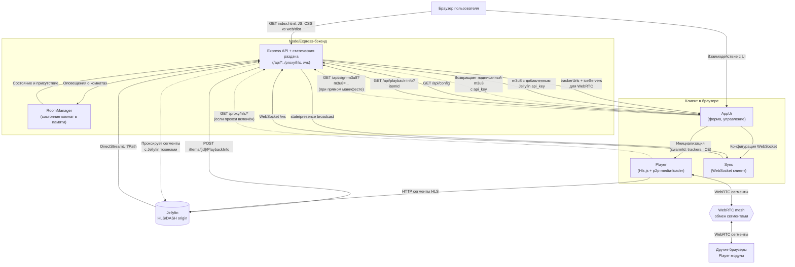

# Архитектурная схема Jellyfin P2P Watch


```mermaid
graph TD
  ClientBrowser[Браузер пользователя]
  subgraph BrowserApp["Клиент в браузере"]
    AppUi["AppUi\n(форма, управление)"]
    Player["Player\n(Hls.js + p2p-media-loader)"]
    Sync["Sync\n(WebSocket клиент)"]
  end

  subgraph ServerSide["Node/Express-бэкенд"]
    BackendAPI["Express API + статическая раздача\n(/api/*, /proxy/hls, /ws)"]
    RoomManager["RoomManager\n(состояние комнат в памяти)"]
  end

  Jellyfin[("Jellyfin\nHLS/DASH origin")]
  Mesh{{"WebRTC mesh\nобмен сегментами"}}
  PeerPlayer["Другие браузеры\nPlayer модули"]

  ClientBrowser -->|"GET index.html, JS, CSS из web/dist"| BackendAPI
  ClientBrowser -->|"Взаимодействие с UI"| AppUi

  AppUi -->|"GET /api/config"| BackendAPI
  BackendAPI -->|"trackerUrls + iceServers\nдля WebRTC"| AppUi

  AppUi -->|"GET /api/playback-info?itemId"| BackendAPI
  BackendAPI -->|"POST /Items/{id}/PlaybackInfo"| Jellyfin
  Jellyfin -->|"DirectStreamUrl/Path"| BackendAPI
  BackendAPI -->|"m3u8 c добавленным Jellyfin api_key"| AppUi

  AppUi -.->|"GET /api/sign-m3u8?m3u8=...\n(при прямом манифесте)"| BackendAPI
  BackendAPI -.->|"Возвращает подписанный m3u8\nс api_key"| AppUi

  AppUi -->|"Инициализация\n(swarmId, trackers, ICE)"| Player
  AppUi -->|"Конфигурация WebSocket"| Sync

  Sync -->|"WebSocket /ws"| BackendAPI
  BackendAPI -->|"state/presence broadcast"| Sync

  BackendAPI -->|"Оповещения о комнатах"| RoomManager
  RoomManager -->|"Состояние и присутствие"| BackendAPI

  Player -->|"HTTP сегменты HLS"| Jellyfin
  Player -.->|"GET /proxy/hls/*\n(если прокси включён)"| BackendAPI
  BackendAPI -.->|"Проксирует сегменты\nс Jellyfin токенами"| Jellyfin

  Player <-->|"WebRTC сегменты"| Mesh
  Mesh <-->|"WebRTC сегменты"| PeerPlayer
```
```
