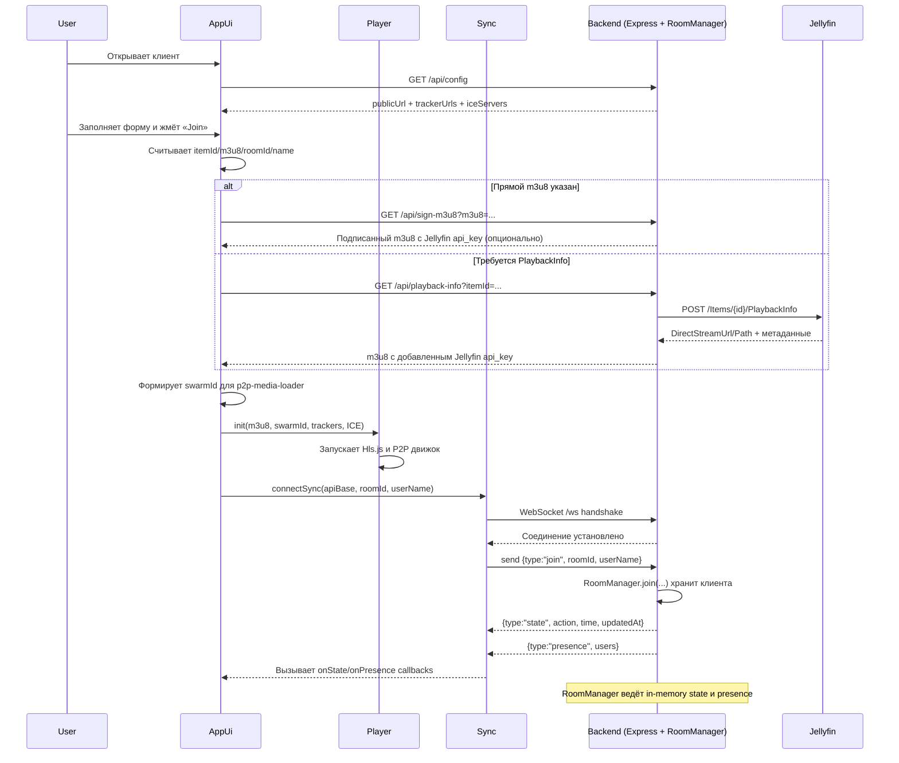

# Последовательность входа в комнату


```mermaid
sequenceDiagram
  participant User as User
  participant AppUi as AppUi
  participant Player as Player
  participant Sync as Sync
  participant Backend as Backend (Express + RoomManager)
  participant Jellyfin as Jellyfin

  User->>AppUi: Открывает клиент
  AppUi->>Backend: GET /api/config
  Backend-->>AppUi: publicUrl + trackerUrls + iceServers
  User->>AppUi: Заполняет форму и жмёт «Join»
  AppUi->>AppUi: Считывает itemId/m3u8/roomId/name
  alt Прямой m3u8 указан
    AppUi->>Backend: GET /api/sign-m3u8?m3u8=...
    Backend-->>AppUi: Подписанный m3u8 с Jellyfin api_key (опционально)
  else Требуется PlaybackInfo
    AppUi->>Backend: GET /api/playback-info?itemId=...
    Backend->>Jellyfin: POST /Items/{id}/PlaybackInfo
    Jellyfin-->>Backend: DirectStreamUrl/Path + метаданные
    Backend-->>AppUi: m3u8 с добавленным Jellyfin api_key
  end
  AppUi->>AppUi: Формирует swarmId для p2p-media-loader
  AppUi->>Player: init(m3u8, swarmId, trackers, ICE)
  Player->>Player: Запускает Hls.js и P2P движок
  AppUi->>Sync: connectSync(apiBase, roomId, userName)
  Sync->>Backend: WebSocket /ws handshake
  Backend-->>Sync: Соединение установлено
  Sync->>Backend: send {type:"join", roomId, userName}
  Backend->>Backend: RoomManager.join(...) хранит клиента
  Backend-->>Sync: {type:"state", action, time, updatedAt}
  Backend-->>Sync: {type:"presence", users}
  Sync-->>AppUi: Вызывает onState/onPresence callbacks
  Note over Backend: RoomManager ведёт in-memory state и presence
```
```
