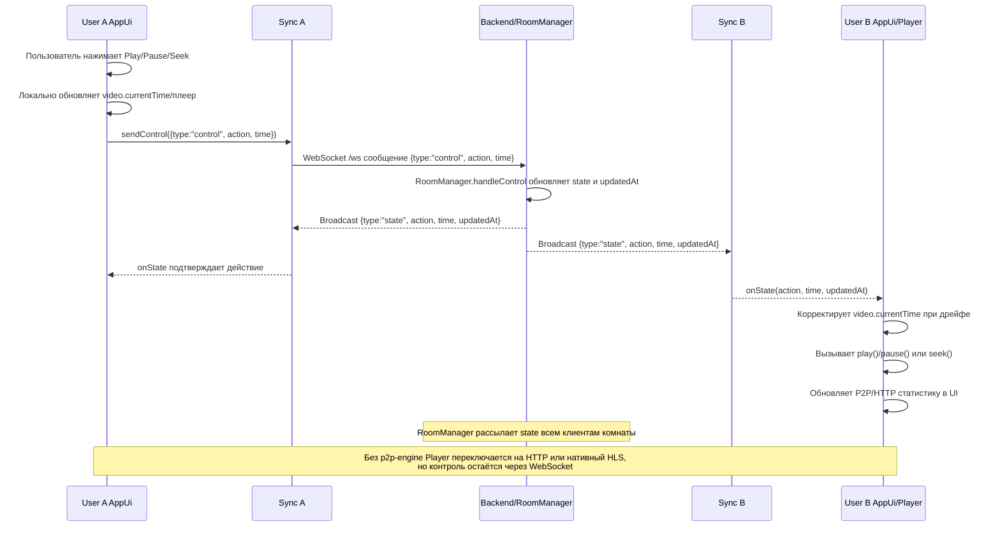

# Сценарий синхронизации управления воспроизведением


```mermaid
sequenceDiagram
  participant UserA as User A AppUi
  participant SyncA as Sync A
  participant Backend as Backend/RoomManager
  participant SyncB as Sync B
  participant UserB as User B AppUi/Player

  UserA->>UserA: Пользователь нажимает Play/Pause/Seek
  UserA->>UserA: Локально обновляет video.currentTime/плеер
  UserA->>SyncA: sendControl({type:"control", action, time})
  SyncA->>Backend: WebSocket /ws сообщение {type:"control", action, time}
  Backend->>Backend: RoomManager.handleControl обновляет state и updatedAt
  Backend-->>SyncA: Broadcast {type:"state", action, time, updatedAt}
  Backend-->>SyncB: Broadcast {type:"state", action, time, updatedAt}
  SyncA-->>UserA: onState подтверждает действие
  SyncB-->>UserB: onState(action, time, updatedAt)
  UserB->>UserB: Корректирует video.currentTime при дрейфе
  UserB->>UserB: Вызывает play()/pause() или seek()
  UserB->>UserB: Обновляет P2P/HTTP статистику в UI
  Note over Backend: RoomManager рассылает state всем клиентам комнаты
  Note over UserA,UserB: Без p2p-engine Player переключается на HTTP или нативный HLS,<br/>но контроль остаётся через WebSocket
```
```
